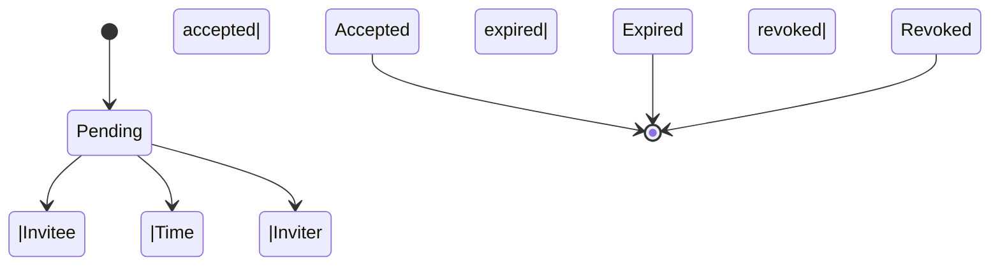

# Organization invitation

## 1. Overview

Invitation defines a way to invite a user to join an [organization](./0001-organization.md), and it is a common feature and the foundation of user collaboration. This specification demonstrates the basics of invitation in Logto, and aims to establish a foundation for future collaboration features.

## 2. Motivation

## 3. Introduction

### 3.1. Invitation

We define an invitation as a data structure that contains the following information:

- **Invitation ID**: A unique identifier for the invitation.
- **Inviter**: The user who created the invitation.
- **Invitee**: The user who received the invitation.
- **Organization**: The organization to which the invitee is invited.
- **Status**: The status of the invitation, which can be `Pending`, `Accepted`, `Revoked`.
- **Created time**: The time when the invitation was created.
- **Updated time**: The last time the invitation was updated.
- **Expiration time**: The time when the invitation expires.
- **Token**: The token used to accept the invitation.

### 3.2. Invitation status

The invitation status has a finite number of states, and the state transition diagram is as follows:

