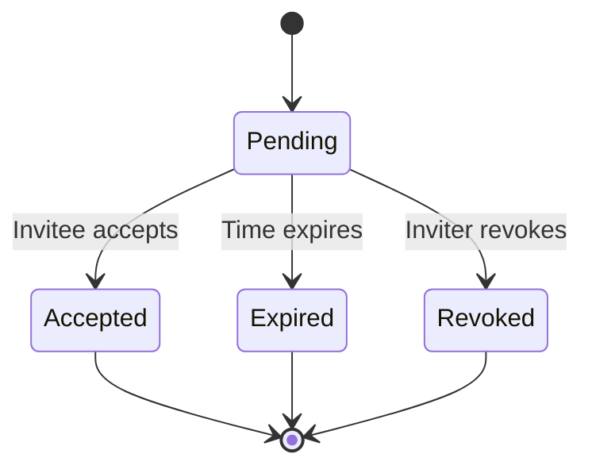

# Organization invitation

## 1. Overview

Invitation defines a way to invite a user to join an [organization](./0001-organization.md), and it is a common feature of user collaboration. This specification demonstrates the basics of invitation in Logto, and aims to provide a standard way to implement the feature.

## 2. Motivation

While organizations built the foundation for multi-tenancy, collaboration features are our next step to enable end users to work together. Invitation is a good starting point, as it is a self-contained feature for Logto Cloud, just like organizations.

## 3. Specification

### 3.1. Invitation

We define an invitation as a data structure that contains the following information:

- **Invitation ID**: A unique identifier for the invitation.
- **Inviter user ID**: The user who created the invitation.
- **Invitee**: The email address of the invitee.
- **Accepted user ID**: The user who accepted the invitation.
- **Organization**: The organization to which the invitee is invited.
- **Status**: The status of the invitation, which can be `Pending`, `Accepted`, `Revoked`, or `Expired`.
- **Created time**: The time when the invitation was created.
- **Updated time**: The last time the invitation was updated.
- **Expiration time**: The time when the invitation expires.
- **Token**: The token used to accept the invitation.

When creating an invitation, the following conditions MUST be met:

- The inviter MUST be a member of the organization.
  - If the inviter is removed from the organization after the invitation is created, the invitation SHOULD be revoked or deleted.
- The email address of the invitee MUST NOT be associated with an existing user that is a member of the organization.

The email address of the invitee can be not associated with any existing user, as the invitee can create a new account with the email address.

### 3.2. Invitation status

The invitation status has a finite number of states, and the state transition diagram is as follows:

#### 3.2.1. Pending

When the invitation is created, the status SHOULD be `Pending`. Meanwhile:

- The expiration time SHOULD be set to a reasonable time in the future. It is RECOMMENDED to set it to no more than 14 days.
- The server SHOULD generate a random invitation token.
- The server SHOULD notify the invitee by the feasible method according to the invitee's email address. For now, we only support email notification.
- The "Accepted user ID" field SHOULD be set to a null value.

#### 3.2.2. Accepted

The invitation can be accepted by a Logto user once the following conditions are met:

- The invitation status is `Pending`.
- The user's email address matches the invitee's email address.
- The user has a normal status (not banned, not deleted, etc.).
- The user is not a member of the organization.
- The invitation token is valid.
- The invitation is not expired or revoked.

When the invitation is accepted:

- The user MUST be added to the organization.
- The invitation status SHOULD be updated to `Accepted`.
- The "Accepted user ID" field SHOULD be set to the user ID of the user who accepted the invitation.
- The "Updated time" field SHOULD be set to the current time.

If the user is already a member of the organization, the invitation SHOULD NOT be accepted.

#### 3.2.3. Expired

When the time expires, it is not required to physically update the status to `Expired` (for example, update the database); but the response to the query invitation API should be `Expired`. It is RECOMMENDED to update the status in proper cases (for example, query the database).

Once the invitation is expired, the invitation SHOULD NOT be updated to any other status.

#### 3.2.4. Revoked

The inviter can revoke the invitation at any time when the invitation status is `Pending`. When the inviter revokes the invitation:

- The invitation status SHOULD be updated to `Revoked`.
- The "Updated time" field SHOULD be set to the current time.

Once the invitation is revoked, the invitation SHOULD NOT be updated to any other status.

### 3.3. Invitation token

The invitation token is a string that is used to accept the invitation and verify the identity of the invitee. The token should be generated randomly and should be long enough to prevent brute force attacks. It is RECOMMENDED to use a string of 32 characters or more.

## 4. Drawbacks

### 4.1. Lack of full operation logs

The specification only defines the creation and update of the invitation, but does not define a way to save and query the operation logs. While it might be useful to be able to audit the logs, the feature can be implemented in a generic way, instead of being tied to the invitation feature.

### 4.2. Lack of invitee rejection or cancellation

The specification does not define a way for the invitee to reject or cancel the invitation. This is because the invitee can simply ignore the invitation if they do not want to accept it, and the expiration time can be used to automatically cancel the invitation.

If there's a need to hide the pending invitations from the invitee, the feature can be implemented on top of this specification. We leave it out of the scope of this specification for now.

## 5. Rationale and alternatives

### 5.1. Support for phone number

While it is possible to support phone number, either as an alternative or in addition to email address, we decided to start with email address only. This is because:

- Email address is more widely used for collaboration features.
- Email address naturally has the concept of domain, which ties well with the organization concept.
- Phone number is more complicated to handle as it requires heavy integration with third-party services.

### 5.2. Decouple invitation from organization

The invitation feature can be decoupled from the organization feature, and be implemented as a standalone feature that can be used for other purposes. However, according to the Occam's razor principle, we decided to keep it simple and start with connecting invitation with organizations.

At least in the foreseeable future, we do not see a need of decoupling.

## 6. Future possibilities

- Support for invitee rejection or cancellation.
- Support for untargeted invitation link, which can be used to invite a user to join an organization without knowing the user's email address.
