# Experience API

## 1. Overview

Sign-in experience is the user authentication process in Logto. It encompasses both the user interface and a set of APIs. This specification introduces a new set of sign-in experience APIs that allow anonymous end-users to interact with Logto for identity verification and profile fulfillment. These APIs are designed to offer developers a flexible and customizable way to create a user-friendly authentication experience.

## 2. Motivation

At Logto, we offer various identification and verification methods for user authentication. The sign-in experience, however, can vary significantly based on different business needs. Developers often require a highly flexible and customizable sign-in process to meet their specific use cases.

Currently, our interaction APIs in Logto are neither well-documented nor publicly available to developers. The only way to customize the sign-in experience is through the predefined sign-in experience settings. To address this, we are introducing a new set of APIs that are developer-friendly and open to the public. These APIs will allow developers to create their own sign-in experiences using customizable UI interfaces, providing the flexibility and control they need.

## 3. Introduction

### 3.1 Terminology

- **Sign-in experience**: An end user's experience when interacting with Logto. Including the front-end user interface and the back-end API calls.
- **Sign-in experience settings**: The settings that define the behavior of the sign-in experience. Including the required identifiers, verification methods, profile data, and MFA settings. Developers can customize the sign-in experience settings to meet their specific requirements.
- **Experience API**: A set of APIs that allow end-users to interact with the Logto for identity verification and profile fulfillment.
- **Experience app**: The front-end application that provides the user interface for sign-in experience.
- **Interaction**: A short-lived session that starts when a user initiates the sign-in experience. By default, it has an expiration time of one hour.
- **Social identity**: The data used to identify a user within a social identity provider, such as Google.
- **SSO (single sign-on) identity**: The data used to identify a user within an identity provider that is configured as an enterprise SSO connector in Logto.
- **Identifier**: A piece of information used to identify a user in Logto. It could be a username, email, phone number, social identity, SSO identity, among others. Each identifier should be unique within its type.
- **Verification code**: A one-time code sent to the user's email or phone number for identity verification.
- **Verification record**: A group of data can be used to verify a user's identity by such as password, verification code, social identity, etc.
- **Verification ID**: A unique identifier for a verification record. It's a random string generated by the Logto server when a verification record is initiated. Users need to provide the verification ID along with additional security information to verify their identity. The verification ID can also be used to track the status of the verification record within the interaction.
- **Multi-factor authentication (MFA)**: A security process that requires more than one verification factor to complete the interaction. It can be used as an additional security check during the sign-in experience.
- **First-party application**: An application that is built and managed by the same developer or team that uses Logto for user identity management.
- **Third-party application**: An application owned and managed by a different entity than the one that built the first-party applications. For example, an external application that uses Logto as an enterprise SSO provider.

### 3.2 User experience

The user sign-in experience in Logto may include the following key steps:

1. **Sign-in experience initiation**: When the client application sends an authentication request to Logto, the user is redirected to the experience app, initiating a new interaction for the authentication and authorization process.
2. **Identification**: The user must provide a verified identifier to Logto, such as a username, email address, phone number, social identity, or SSO identity. This identifier is used to identify the user during the interaction.
3. **Verification**: The process to verify a user's identity by requesting additional security information. This can be a one-time code, or a passkey, etc. Depending on the security settings, multiple verification methods can be used.
4. **Profile fulfillment**: During the interaction, the user may be prompted to complete their profile and / or verification settings. This can be necessary for user registration or mandatory updates for existing users.
5. **Authentication**: Once the user has completed all the necessary steps, they can submit the interaction to get authenticated by Logto. All the user's profile and MFA settings updates will be saved to the user database.
6. **Consent**: Users may need to grant consent for specific actions upon the requested authorization details. This could involve sharing personal information, allowing access for their organization, or granting permissions to specific resources. For first-party applications, consent is implicit and handled automatically by Logto once the user gets authenticated. For third-party applications, consent is explicit, and the user will be prompted to grant the necessary permissions after a successful interaction submission.
7. **Authorization**: The final step in the sign-in experience. Once the user has been authenticated and consented to the necessary actions, they will be redirected back to the client application with granted authorization.

## 4. Definitions

### 4.1 Interaction event

Interaction event represent the user's current interaction purpose with Logto. Logto will use the interaction event to track the user's interaction progress and provide the corresponding interaction validation and actions.

The following are the types of interaction event supported by Logto:

- **Register**: A new user signs up for an account in Logto.
- **SignIn**: An existing user signs in to their account in Logto.
- **ForgotPassword**: A user forgets the password and initiates an account recovery process to reset their password.

### 4.2 Identifiers

The following are the types of identifiers supported by Logto that can be used to uniquely identify a user in the interaction:

- **Username**: A user's unique username.
- **Email**: A verified user's email address.
- **Phone**: A verified user's phone number.
- **Social identity**: A verified user identity data provided by a social identity provider.
- **SSO identity**: A verified user identity data provided by an enterprise SSO connector.

### 4.3 Verification record

A verification record contains the necessary security information to verify a user's identity. One or more verification records can be created and verified via Experience API during the interaction.

#### 4.3.1 Identifier verification

Identifier verification can be used to verify the user's identity with a given identifier. A successful identifier verification will update the [interaction status](#52-interaction-status) from `Initiated` to `Identified`.

- **Password**: The user's password, which is the most common method for verifying identity. It can be used to verify the user's `username`, `email`, or `phone` identifier.
- **EmailVerificationCode**: A one-time code sent to the user's email for identity verification. It can be used to verify the user's `email` identifier.
- **PhoneVerificationCode**: A one-time code sent to the user's phone for identity verification. It can be used to verify the user's `phone` identifier.
- **Social**: An authenticated social identity verification record. Directly identify and verify a user with a social identity provider.
- **EnterpriseSso**: An authenticated SSO identity verification record. Directly identify and verify a user with an enterprise SSO provider.

#### 4.3.2 Multi-factor authentication (MFA) verification

MFA is a security process that requires more than one verification factor to confirm a user's identity. It can be used as an additional security check during user interaction. Developers can enable MFA using Logto's sign-in experience settings. Once enabled, users will be prompted to provide additional MFA verification records.

NOTE: MFA verifications can only be created and verified when the interaction status is `Identified`. These MFA verification records can be used to verify the existing user's MFA settings or to bind new MFA settings for the user.

The following are the MFA verification record types supported by Logto:

- **TOTP**: A time-based one-time code generated by a TOTP app for identity verification.
- **WebAuthn**: A WebAuthn (passkey) credential used to verify a user's identity.
- **BackupCode**: A set of backup codes used to verify a user's identity when other MFA verification methods are unavailable.

#### 4.3.3 New password identity verification

**NewPasswordIdentity** verification record is a special type of verification record that is used to quickly set up a new password identity for the user. It is for new user registration only.

Currently, only `username` is supported as the identifier for the new password identity. As for the `email` and `phone` identifiers, a `VerificationCode` verification record is required to verify the identifier before the new password can be set.

### 4.4 User profile

The user profile consists of the user data that will be stored in the Logto database. Developers can use Logto sign-in experience settings to define the required profile data and MFA settings that need to be collected from the user before user gets authenticated.

- For the `Register` interaction event, all the user profile data provided before the user is identified will be used to create a new user account in the user database. Any additional profile data and MFA settings provided after the user creation and identification will be updated in the user database once the interaction is submitted.
- For the `SignIn` interaction event, the user profile can only be updated after the user is identified. Any additional profile data and MFA settings provided will be updated in the user database once the interaction is submitted.
- The `ForgotPassword` interaction event. Only the password can be updated during the interaction. The password can only be set after the user is identified. The new password will be updated in the user database once the interaction is submitted.

#### 4.4.1 User identifier

[User identifiers](#42-identifiers) can be configured as a requirement for the user profile in the sign-in experience settings. The user must provide the necessary identifiers to identify themselves during the interaction.

- Except for the `username` identifier, all other identifiers must be verified via a verification record before they can be used to identify the user and stored in the user profile.

#### 4.4.2 Password

The user's password can be used as a primary verification method to verify the user's identity during the interaction. The password can be set, updated, based on different interaction events:

- The `password` can be set during a register interaction event.
- The `password` can be set and updated during a forgot password interaction event.
- The `password` can be set during the sign-in interaction event only if the user has not set a password before.

#### 4.4.3 MFA settings

In order to meet the MFA requirement, the user must provide necessary MFA settings to Logto. The following MFA settings can be created and attached to the user during the interaction:

- **TOTP secret**: A TOTP secret used to generate time-based one-time codes for MFA verification. A `TOTP` verification record is required to verify the TOTP secret.
- **WebAuthn registration**: A WebAuthn credential used to verify a user's identity. A `WebAuthn` verification record is required to verify the WebAuthn registration.
- **Backup codes**: A set of Logto generated one-time backup codes that can be used to verify a user's identity when other MFA verification methods are unavailable. The backup codes can be used as an alternative MFA verification method during the interaction. New backup codes can be generated by creating a `BackupCode` verification record.

All the MFA settings can only be added to the user's profile via a verified `MFA` verification record.

- **Skip MFA**: A flag to skip the MFA setup process if the MFA settings are optional in the sign-in experience settings.

## 5. Interaction

Logto uses interactions to track the user's progress and status during the sign-in experience. All the interaction data will be stored in the short-lived authentication session and submitted to Logto once the user completes the interaction.

### 5.1 Interaction data

- `userId` (string): The unique ID of the user for the current interaction. Only available once the user is identified by at least one verified identifier.
- `interactionEvent` (enum): The [interaction event](#41-interaction-event) for the current interaction.
- `verificationRecords` (array): The [verification record](#43-verification-record) list created during the current interaction.
- `profile` (object): The user provided [profile data](#44-user-profile) in the current interaction that needs to be updated.
- `mfa` (object): The user provided [MFA settings](#443-mfa-settings) in the current interaction that needs to be binding to the user's profile.

### 5.2 Interaction status

In a sign-in experience, the user's interaction progress will be tracked based on the sign-in experience settings and the data provided by the user. Interaction status will be used to determine the user's current progress and the required actions to complete the interaction. It is a real-time computed value based on the user's interaction progress and the data presented in the interaction. It will be updated automatically once the user completes the required actions.

Here are the interaction statuses defined in Logto:

- **Initiated**: The interaction is initiated by the user and the [interaction event](#41-interaction-event) is specified for the current interaction.
- **Identified**: The user is identified by a verified identifier. Once the user is identified, a unique `userId` will be set in the interaction. In a `Register` interaction, a new user account will be created in the user database, and the `userId` will be set in the interaction. The identified status cannot be unset once the user is successfully identified in the interaction.
- **Verified**: The user is verified by all the necessary verification records, including the MFA. It is computed based on the verified `verificationRecords` in the interaction and the sign-in experience settings. The interaction will be considered as `Verified` only if the user is identified and all the necessary verification records are verified. Any newly added verification requirements in the sign-in experience settings will revert the status back to `Identified` until the new requirements are met.
- **Profile fulfilled**: The user has provided all the necessary profile data and MFA settings. It is computed based on the `profile` in the interaction and the sign-in experience settings. The interaction is considered as `Profile fulfilled` only if the user is verified and all the necessary profile data and MFA settings are provided.

#### 5.2.1 Sign-in interaction

The sign-in interaction may vary based on the sign-in experience settings. Here's how interaction status changes during a sign-in interaction:

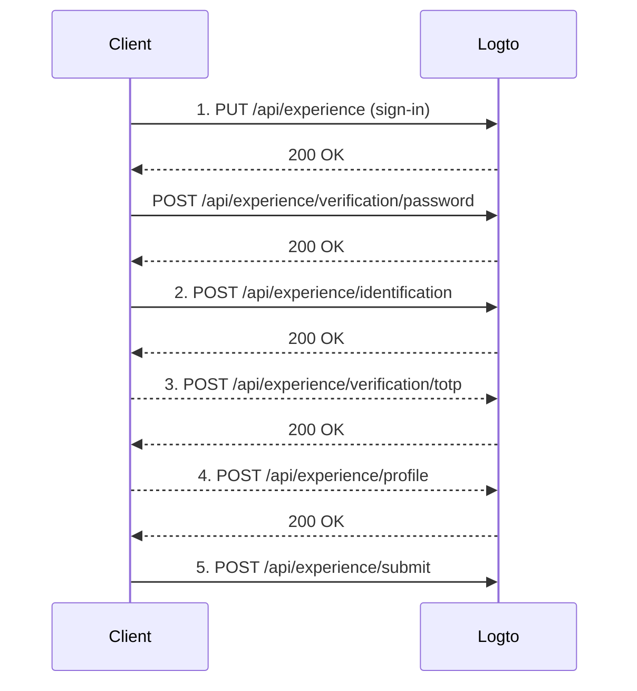
```mermaid
sequenceDiagram
    participant C as Client
    participant L as Logto

    C->>L: 1. PUT /api/experience (sign-in)
    L-->>C: 200 OK
    C->>L: POST /api/experience/verification/password
    L-->>C: 200 OK
    C->>L: 2. POST /api/experience/identification
    L-->>C: 200 OK
    C-->>L: 3. POST /api/experience/verification/totp
    L-->>C: 200 OK
    C-->>L: 4. POST /api/experience/profile
    L-->>C: 200 OK
    C->>L: 5. POST /api/experience/submit
```

1. Initiated: The interaction is initiated with a `SignIn` interaction event.
2. Identified: The user is identified by a verified identifier.
3. Verified: The user is verified by all the necessary MFA verification records. If no MFA is required, the interaction will be considered as `Verified` directly.
4. Profile fulfilled: The user has provided all the necessary profile data and MFA settings during the interaction.
5. Submitted: The user has submitted the interaction to Logto for authentication. The user profile and MFA settings will be updated in the user database. Continue to the consent and authorization process.

#### 5.2.2 Register interaction

Based on the user's sign-in experience progress and user provided data, Logto will track the register interaction using the following status:

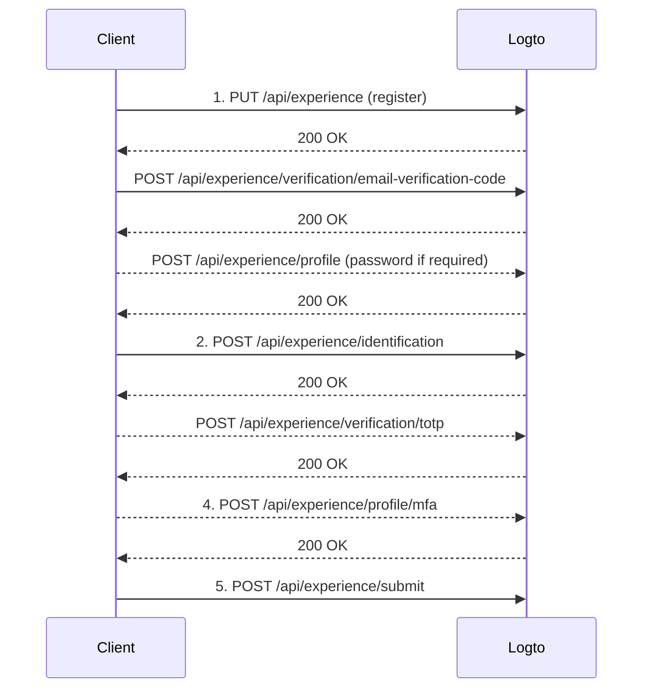
```mermaid
sequenceDiagram
    participant C as Client
    participant L as Logto

    C->>L: 1. PUT /api/experience (register)
    L-->>C: 200 OK
    C->>L: POST /api/experience/verification/email-verification-code
    L-->>C: 200 OK
    C-->>L: POST /api/experience/profile (password if required)
    L-->>C: 200 OK
    C->>L: 2. POST /api/experience/identification
    L-->>C: 200 OK
    C-->>L: POST /api/experience/verification/totp
    L-->>C: 200 OK
    C-->>L: 4. POST /api/experience/profile/mfa
    L-->>C: 200 OK
    C->>L: 5. POST /api/experience/submit
```

1. Initiated: The interaction is initiated with a `Register` interaction event.
2. Identified: The new user account is created in the user database with all the required profile data provided and verified.
3. (Verified): Since there is no MFA settings provided to the user account yet, the interaction will be considered as `Verified` directly.
4. Profile fulfilled: The user has provided all the additional profile data and mandatory MFA settings during the interaction.
5. Submitted: The user has submitted the interaction to Logto for authentication. The user profile and MFA settings will be updated in the user database. Continue to the consent and authorization process.

#### 5.2.3 Forgot password event interaction status

- Only `email` and `phone` identifiers can be used to identify the user for the forgot password interaction in Logto.
- The user must provide a valid verification code verification record to verify the identifier during the interaction.
- All other types of identifiers and verification records are ignored during the forgot password interaction.
- Only password can be set in the user's profile during the forgot password interaction.
- The forgot password interaction does not require any MFA verification, so the interaction status will never be `Verified`.

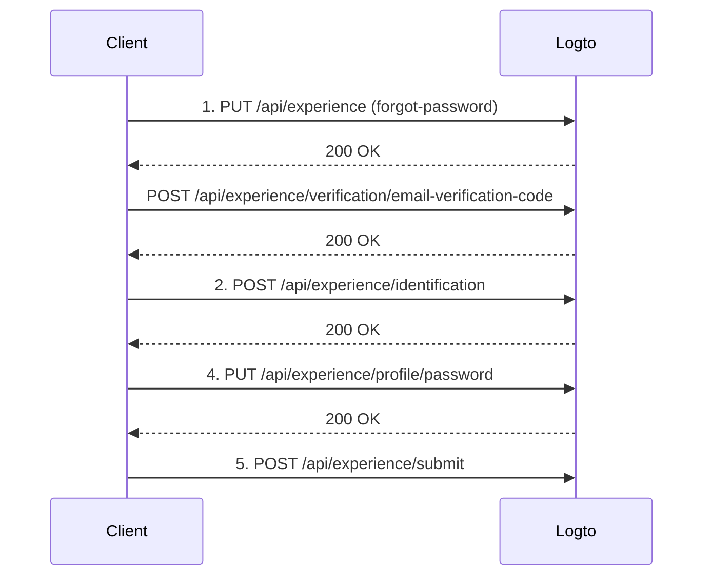
```mermaid
sequenceDiagram
    participant C as Client
    participant L as Logto

    C->>L: 1. PUT /api/experience (forgot-password)
    L-->>C: 200 OK
    C->>L: POST /api/experience/verification/email-verification-code
    L-->>C: 200 OK
    C->>L: 2. POST /api/experience/identification
    L-->>C: 200 OK
    C->>L: 4. PUT /api/experience/profile/password
    L-->>C: 200 OK
    C->>L: 5. POST /api/experience/submit
```

1. Initiated: The interaction is initiated with a `ForgotPassword` interaction event.
2. Identified: The user is identified by at least one verified identifier email or phone.
3. (Verified): `ForgotPassword` interaction does not require any MFA verification.
4. Profile fulfilled: The user has provided the new password during the interaction.
5. Submitted: The user has submitted the interaction, the new password will be updated in the user database. Interaction will be completed and the user will be redirected to the sign-in page.

## 6. Drawbacks

### 6.1 Compatibility

Unlike the current internal interaction APIs, the new Experience API is publicly available to the developers, as they can be used to build a customized sign-in experience. This means any changes to the Experience API may impact the existing developers who rely on these APIs to build their sign-in experience. We need to ensure backward compatibility and carefully version the Experience API to avoid breaking changes for the developers.

### 6.2 Complexity

The new Experience API is stateful and tightly coupled with the interaction in the Logto server. Developers must fully understand the concept of interactions in Logto and the related sign-in experience settings to use the APIs correctly. This requirement can increase the learning curve and development complexity, potentially leading to misuse or integration errors if not properly understood and implemented.

### 6.3 Cost

Introducing a new set of APIs will require additional development effort and maintenance cost. Unlike our current internal interaction APIs, these new APIs need to be well-documented and maintained to ensure a consistent and reliable sign-in experience for the developers.

We will need to keep two sets of APIs in sync to ensure that the new APIs are up-to-date with the internal interaction APIs. This will require additional development and testing effort to maintain the consistency between these two sets of APIs.

### 6.4 Performance overhead

To maintain interaction status and decouple API logic, multiple API requests are required from the client side. For example, an additional submit request must be called each time to submit and validate the interaction requirements, even for a simple username and password sign-in flow. This increases the number of API calls, potentially leading to higher latency and reduced performance.

## 7. Rationale and alternatives

Logto provides a variety of authentication and verification methods to meet the diverse needs of developers and end-users. We have been constantly improving the sign-in experience configurations and providing extra customization options for the developers to build a flexible and secure sign-in experience.

As the sign-in experience is a critical part of the user authentication process, and it is hard to enumerate all the possible use cases, we believe that opening up the experience APIs to the developers with a customizable front-end user interface will provide more flexibility and control over the sign-in experience.

### 7.1 Considerations

1. Developer friendliness: The current internal interaction APIs are not well-documented and are difficult for developers to use. These APIs are tightly coupled with Logto's server-side interaction logic and involve numerous Logto-specific concepts and definitions, resulting in a steep learning curve. We believe that providing a new set of well-documented and user-friendly experience APIs will significantly ease the development process for creating customized sign-in experiences. Additionally, we need to offer a detailed explanation of the underlying user interaction structure to help developers better understand the sign-in experience.

2. High flexibility: We have identified several limitations in the current internal interaction APIs, such as the lack of support for custom user profile fields and the increasingly bloated interaction structure within the Logto server. By introducing the new experience API, we can redefine the interaction in Logto, enhancing the flexibility and sustainability of the sign-in experience.

### 7.2 Alternatives

Considering no extra new features or customization options are added, instead of introducing a new set of APIs, we could consider providing comprehensive documentation for the existing internal interaction APIs. This approach would minimize the risk of breaking changes to the sign-in experience. However, even with detailed documentation, developers may still find it challenging to understand and effectively use these internal interaction APIs.

Moreover, continuing to use our existing APIs and interaction design will likely lead to a rapidly increasing maintenance effort as we keep introducing new features and flows to our system. Eventually, we will reach a point where refactoring and migrating our existing sign-in experience logic will be unavoidable. Therefore, the best time to implement these changes is now.

## 8. Future possibilities

### 8.1 User profile management

The verification and user profile APIs can be extended to support more advanced user profile management features, outside the sign-in experience. For example, users can update their profile data, manage their MFA settings, and view their interaction history using the Experience APIs through a dedicated user profile management interface.

### 8.2 Simplified API calls

Reduce the complexity of the API calls. We are considering merging several API calls into a single API call to simplify the user interaction flow. For example, omit the extra submit request for the sign-in experience, consider introducing an `autoSubmit` flag in some of the interaction APIs to automatically submit the interaction once all the requirements are met.

### 8.3 Support custom user profile

The user profile data can be extended to support custom user profile fields during the sign-in experience. Developers can define and set required custom profile fields for the user during the interaction. This will allow developers to collect additional user data and customize the user profile based on their specific use cases.

### 8.4 Experience API SDK

Developing a client-side SDK that simplifies the integration of the Experience API into the front-end application. The SDK can provide a set of pre-built components and functions that handle the interaction flow, user profile management, and MFA settings. This will help developers quickly integrate the Experience API into their applications and build a customized sign-in experience with minimal effort.

### 8.5 Standalone verification APIs

Currently, a verification record is created directly via the Experience API. We may provide standalone verification APIs to create and verify these verification records without an interaction context. This will allow developers to customize the verification process and use it in a separate flow, e.g., building a GitHub-like `sudo` mode.

## Appendix A. Experience API

All experience API can be called from the experience app to interact with Logto for user identity verification and profile fulfillment. The APIs are designed to be stateful and require an interaction context to track the user's progress and status during the sign-in experience. All the APIs are using the `POST` method with action-based endpoints to represent the user's interaction purpose with Logto.

### 1. Experience interaction API

The experience interaction API is the core API used to initiate and manage the user's interaction with Logto during the sign-in experience.

- `PUT /api/experience`

  Initiate a new interaction for the user to start the sign-in experience.

  - A [interaction event](#41-interaction-event) must be specified to define the user's interaction purpose with Logto.
  - Any existing interaction data will be cleared once a new interaction is initiated.

  Request body:

  | Field            | Type             | Description                                        | Required |
  | ---------------- | ---------------- | -------------------------------------------------- | -------- |
  | interactionEvent | InteractionEvent | The interaction event for the current interaction. | Yes      |

- `POST /api/experience/submit`

  The `submit` API is used to submit the user's interaction to the Logto.

  - All precondition checks will be performed before submitting the interaction. The interaction will be rejected if any of the checks fail.
  - The interaction must be `Identified`, `Verified`, and `Profile fulfilled` to be submitted successfully.
  - Once the interaction is submitted, the new user profile and MFA settings will be updated in the user database.

- `PUT /api/experience/interaction-event`

  Update the interaction event for the current interaction.

  - The interaction event can be updated during the interaction to change the user's interaction purpose with Logto.
  - Only `SignIn` and `Register` interaction events are allowed to be interchanged during the interaction.
  - All the `verificationRecords` will remain unchanged once the interaction event is updated.
  - The interaction status will be recalculated based on the updated interaction event.
  - The `profile` will be cleared once the interaction event is updated. This is to prevent anonymous user profile data (from register event) from being used in the sign-in flow.
  - A non-existing verified email/phone verification record can be used to directly create a new user account by changing the interaction event from `SignIn` to `Register`.
  - An existing verified email/phone verification record can be used to directly sign-in to the user account by changing the interaction event from `Register` to `SignIn`.
  - A social/enterprise SSO identity verification record can be used to directly create a new user account by changing the interaction event from `SignIn` to `Register`.

  Request body:

  | Field            | Type             | Description                                        | Required |
  | ---------------- | ---------------- | -------------------------------------------------- | -------- |
  | interactionEvent | InteractionEvent | The interaction event for the current interaction. | Yes      |

### 2. Verification APIs

The verification APIs (APIs start with `/api/experience/verification`) are a set of APIs used to create and verify a verification record for the user during the sign-in experience.

#### Password

- `POST /api/experience/verification/password`

  Create a new password verification record for the user to verify the password during the sign-in experience.

  - A new password verification record will be created in the interaction.
  - The password verification record will be verified if the password is correct.

  Request body:

  | Field      | Type       | Description            | Required |
  | ---------- | ---------- | ---------------------- | -------- |
  | identifier | Identifier | The user's identifier. | Yes      |
  | password   | string     | The user's password.   | Yes      |

#### Social/SSO

- `POST /api/experience/verification/{social|sso}/:connectorId/authorization-uri`

  Generate an authorization URI for the user to authenticate with a third-party social or enterprise identity provider.

  - A social/SSO verification record will be created in the interaction.
  - The unique `verificationId` will be generated for the verification record.
  - A `redirectUrl` will be generated for the user to authenticate with the social/SSO provider.

- `POST /api/experience/verification/{social|sso}/:connectorId/verify`

  Authenticate the user with the social/SSO provider and identify the user with the authenticated social/SSO identity.

  - The social/SSO verification record will be verified in the interaction.
  - The `verificationId` is required to retrieve the social/SSO verification record from the interaction.
  - For Google one tap sign-in, the `verificationId` can be omitted. A new verification record will be created.

  Request body:

  | Field          | Type                   | Description                                | Required |
  | -------------- | ---------------------- | ------------------------------------------ | -------- |
  | data           | Record<string, string> | Callback data from the social/SSO provider | YES      |
  | verificationId | string                 | The verification record id                 | NO       |

#### Verification code

- `POST /api/experience/verification/verification-code`
  Send a verification code to the user's email or phone number for identifier verification.

  - A verification code record will be created in the interaction.
  - The unique `verificationId` will be generated for the verification record.
  - A code will be sent to the given `identifier`.
  - The interaction event is required to specify the message template for the verification code.

  Request body:

  | Field            | Type             | Description                                                     | Required |
  | ---------------- | ---------------- | --------------------------------------------------------------- | -------- |
  | identifier       | Identifier       | The user's identifier.                                          | Yes      |
  | interactionEvent | InteractionEvent | The `interaction event` that triggers the verification process. | Yes      |

- `POST /api/experience/verification/verification-code/verify`

  The concurrent API to verify the given `identifier` with the provided verification code.

  - The verification record will be verified in the interaction, if the code is verified successfully.

  Request body:

  | Field          | Type       | Description                                           | Required |
  | -------------- | ---------- | ----------------------------------------------------- | -------- |
  | identifier     | Identifier | The user's identifier.                                | Yes      |
  | code           | string     | The verification code to verify the given identifier. | Yes      |
  | verificationId | string     | The unique id for the verification record.            | Yes      |

#### TOTP

- `POST /api/experience/verification/totp/secret`

  Create a new TOTP secret for the user to set up the TOTP MFA method. Required for the first time registration of the TOTP MFA method.

  - A new TOTP secret will be generated for the user.
  - A new TOTP verification record will be created in the interaction.

- `POST /api/experience/verification/totp/verify`

  TOTP verification API.

  - For the first time verification of a new added TOTP secret, the `verificationId` is required.
  - For the first time verification of a new added TOTP secret, the verification record will be verified.
  - For the first time verification of a new added TOTP secret, the new TOTP secret will be inserted into the user profile in the interaction as a new MFA setting.
  - For the existing TOTP secret verification, the `verificationId`is empty.
  - For the existing TOTP secret verification, a verified TOTP verification record will be created.

  Request body:

  | Field          | Type   | Description                                      | Required |
  | -------------- | ------ | ------------------------------------------------ | -------- |
  | code           | string | The TOTP to verify the TOTP MFA method           | Yes      |
  | verificationId | string | The verification id for the new generated secret | NO       |

#### WebAuthn

- `POST /api/experience/verification/web-authn/registration`

  Create a new WebAuthn registration options object for the user to set up the WebAuthn MFA method. Required for the first time registration of the WebAuthn MFA method.

  - A new WebAuthn registration options object will be generated for the user.
  - A new WebAuthn verification record will be created in the interaction with the generated WebAuthn registration options.

- `POST /api/experience/verification/web-authn/authentication`

  Create a new WebAuthn authentication options object for the user to verify the WebAuthn MFA method.

  - A new WebAuthn authentication options object will be generated for the user.
  - A new WebAuthn verification record will be created in the interaction with the generated WebAuthn authentication options.

- `POST /api/experience/verification/web-authn/registration/verify`

  The concurrent API to verify the WebAuthn MFA registration with the provided WebAuthn assertion.

  - The WebAuthn assertion data will be verified with the WebAuthn verification record in the interaction.
  - The WebAuthn verification record will be verified if the assertion is successful.
  - The verified WebAuthn registration can be used to set up new WebAuthn MFA method in the user profile via the profile API.

  Request body:

  | Field             | Type              | Description                                                   | Required |
  | ----------------- | ----------------- | ------------------------------------------------------------- | -------- |
  | webAuthnAssertion | WebAuthnAssertion | The WebAuthn assertion data to verify the WebAuthn MFA method | Yes      |
  | verificationId    | string            | The verification record id                                    | Yes      |

- `POST /api/experience/verification/web-authn/authentication/verify`

  The concurrent API to verify the WebAuthn MFA authentication with the provided WebAuthn assertion.

  - The WebAuthn assertion data will be verified with the WebAuthn verification record in the interaction.
  - The WebAuthn verification record will be verified if the assertion is successful.

#### Backup codes

- `POST /api/experience/verification/backup-code/generate`

  Generate a set of backup codes for the user to use as an alternative MFA verification method. This verification record can be used to set up new backup code MFA method in the user profile via the profile API.

- `POST /api/experience/verification/backup-code/verify`

  Verify the Backup Code MFA method with the provided backup code.

  - A verified backup code verification record will be created in the interaction if the backup code is verified successfully.

  Request body:

  | Field      | Type   | Description           | Required |
  | ---------- | ------ | --------------------- | -------- |
  | backupCode | string | The backup code value | Yes      |

#### New password identity

- `POST /api/experience/verification/new-password-identity`

  Create a new password identity for new user registration use.

  - A `NewPasswordIdentity` verification record will be created in the interaction.
  - The `password` will be verified against the password policy settings.
  - The `identifier` will be verified against the existing user database.
  - Only `username` is supported as the identifier of the new password identity for now.
  - Can only be used in the `Register` interaction event to create and identify a new user account.

  Request body:

  | Field      | Type       | Description            | Required |
  | ---------- | ---------- | ---------------------- | -------- |
  | password   | string     | The user's password.   | Yes      |
  | identifier | Identifier | The user's identifier. | Yes      |

### 3. Identification API

`POST /api/experience/identification`

The identification API is used to identify the user with the given identifier during the sign-in experience. For the register interaction, the user will be created in the user database once a verified identifier is provided.

Request body:

| Field              | Type    | Description                                                                                                                                         | Required |
| ------------------ | ------- | --------------------------------------------------------------------------------------------------------------------------------------------------- | -------- |
| verificationId     | string  | The verification record id that can be used to identify the user.                                                                                   | NO       |
| linkSocialIdentity | boolean | Link the new social identity to a existing user account with same email. Use this flag to link the new social identity to an existing user account. | NO       |

#### Sign-in interaction

- The current `interactionEvent` is specified as `SignIn`.
- The `verificationId` is required to identify the user with the given identifier.
- The `userId` will be set in the interaction if the user is successfully identified.
- Once the user is identified, the interaction status will be changed to `Identified`.
- A non-exist new social identity with a verified email can be linked to an existing user account with the same email by setting the `linkSocialIdentity` flag to `true`.

#### Register interaction

- The current `interactionEvent` is specified as `Register`.
- If the `verificationId` is provided, update the interaction profile using the provided verification record first.
- If the `verificationId` is not provided, directly validate the existing profile data and create a new user account.
- Mandatory profile validations will be performed before user creation.
- A new user account will be created in the user database if the all the profile validations are passed.
- The `userId` will be set in the interaction if the user is successfully created.
- Once the user is identified, the interaction status will be changed to `Identified`.

#### Forgot password interaction

- The current `interactionEvent` is specified as `ForgotPassword` .
- The `verificationId` is required to identify the user with the given identifier. Only the `verificationCode` verification record is allowed for the forgot password interaction.
- The `userId` will be set in the interaction if the user is successfully identified.
- Once the user is identified, the interaction status will be changed to `Identified`.

### 4. Profile API

The profile API is used to provide additional profile data and MFA settings during the interaction. Based the sign-in experience settings, the user must provide the necessary profile data and MFA settings to complete the interaction.

- In `Register` interaction event, the profile API can be used to provide the necessary profile data to create a new user account before the user is identified.
- In `SignIn` interaction event, the profile API can be used to fulfill the additional profile data and MFA settings that are required by the sign-in experience after the user is `identified` and `verified`.
- In `ForgotPassword` interaction event, the profile API can be used to set a new password for the user after the user is identified.

- `POST /api/experience/profile`

  The profile API to update the user's profile by a given type and value. Based on the profile type, verification record maybe required to verify the profile data.

  Request body:

  | Field          | Type   | Description                                      | Required |
  | -------------- | ------ | ------------------------------------------------ | -------- |
  | type           | union  | The profile data type to update.                 | YES      |
  | value          | string | The profile data value to update.                | NO       |
  | verificationId | string | The verification record id for the profile data. | NO       |

  Supported request body collections:

  | Type     | verificationId | value |
  | -------- | -------------- | ----- |
  | email    | YES            | NO    |
  | phone    | YES            | NO    |
  | password | NO             | YES   |
  | username | NO             | YES   |
  | social   | YES            | NO    |

- `PUT /api/experience/profile/password`

  The profile API to reset the user's password in the `ForgotPassword` interaction event.
  For the first time password fulfillment, in the `Register` or `SignIn` interaction event, use the above `POST /api/experience/profile` instead.

  Request body:

  | Field    | Type   | Description       | Required |
  | -------- | ------ | ----------------- | -------- |
  | password | string | The new password. | Yes      |

- `POST /api/experience/profile/mfa`

  The mfa profile API to bind the MFA method to the user's profile.

  Request body:

  | Field          | Type      | Description                             | Required |
  | -------------- | --------- | --------------------------------------- | -------- |
  | type           | MfaFactor | The MFA type to update in the profile.  | NO       |
  | verificationId | string    | The verification record id for the MFA. | Yes      |

- `POST /api/experience/profile/mfa-skipped`

  Mark the MFA setup process as skipped in the interaction. Only available if the MFA setup is optional in the sign-in experience settings.

## Appendix B. Examples

### 1. Sign-in with username and password

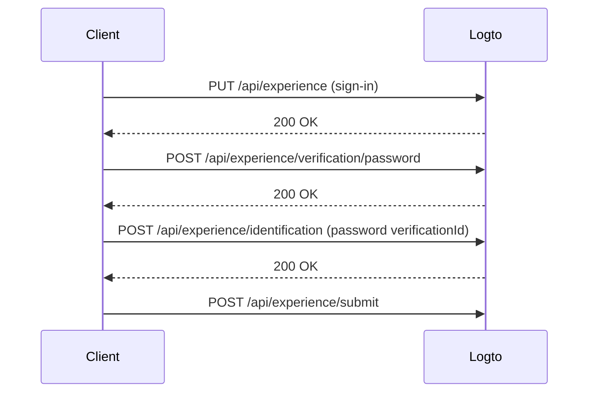
```mermaid
sequenceDiagram
    participant C as Client
    participant L as Logto

    C->>L: PUT /api/experience (sign-in)
    L-->>C: 200 OK
    C->>L: POST /api/experience/verification/password
    L-->>C: 200 OK
    C->>L: POST /api/experience/identification (password verificationId)
    L-->>C: 200 OK
    C->>L: POST /api/experience/submit
```

### 2. Sign-in with username / password and fulfill email

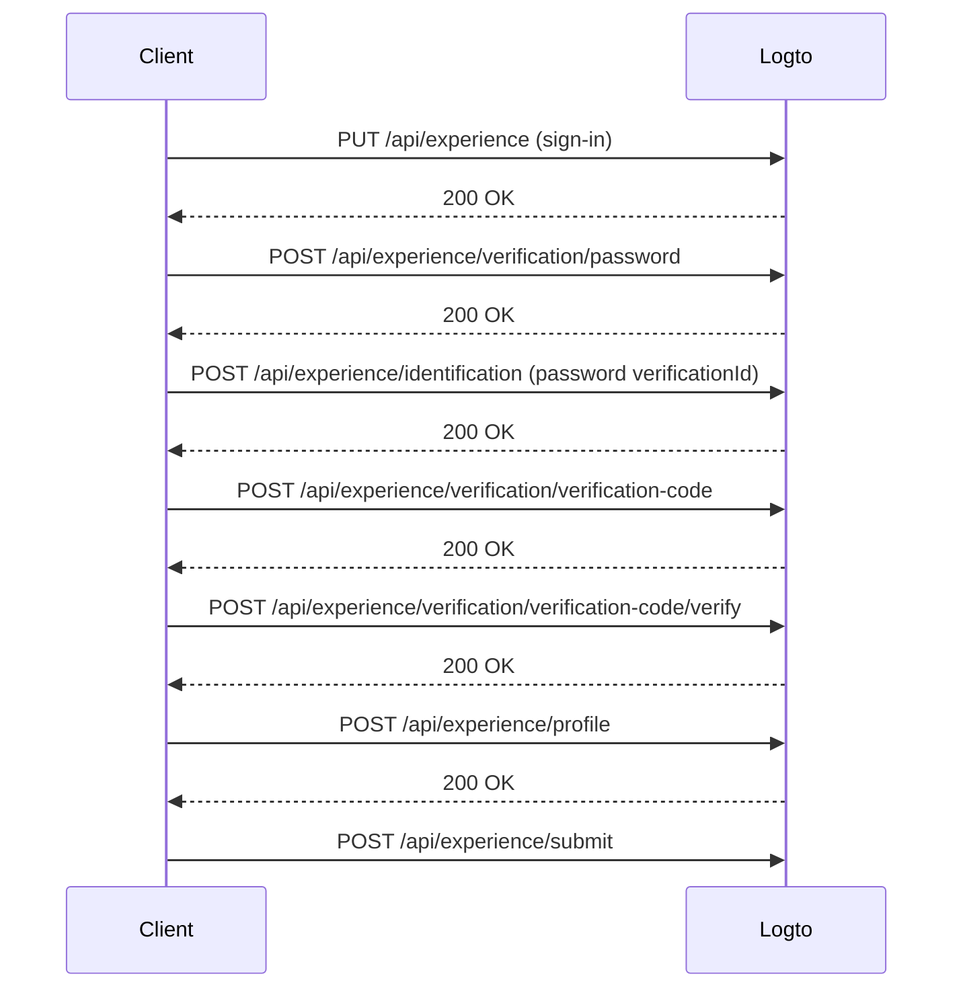
```mermaid
sequenceDiagram
    participant C as Client
    participant L as Logto

    C->>L: PUT /api/experience (sign-in)
    L-->>C: 200 OK
    C->>L: POST /api/experience/verification/password
    L-->>C: 200 OK
    C->>L: POST /api/experience/identification (password verificationId)
    L-->>C: 200 OK
    C->>L: POST /api/experience/verification/verification-code
    L-->>C: 200 OK
    C->>L: POST /api/experience/verification/verification-code/verify
    L-->>C: 200 OK
    C->>L: POST /api/experience/profile
    L-->>C: 200 OK
    C->>L: POST /api/experience/submit
```

### 3. Sign-in with username / password with MFA (TOTP) verification

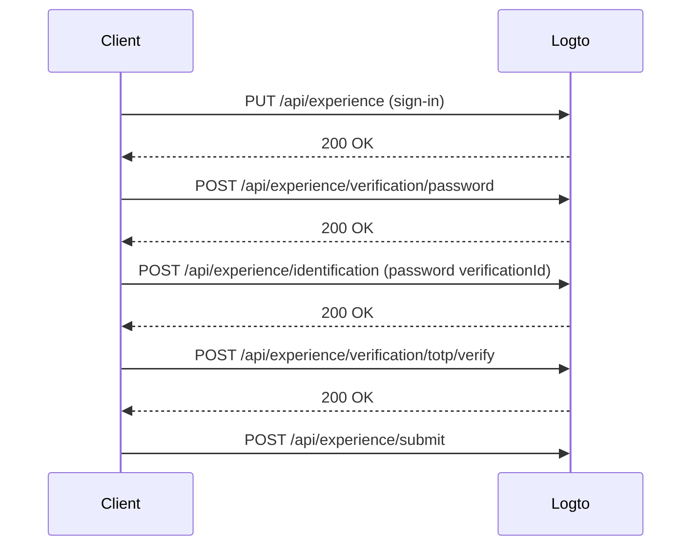
```mermaid
sequenceDiagram
    participant C as Client
    participant L as Logto

    C->>L: PUT /api/experience (sign-in)
    L-->>C: 200 OK
    C->>L: POST /api/experience/verification/password
    L-->>C: 200 OK
    C->>L: POST /api/experience/identification (password verificationId)
    L-->>C: 200 OK
    C->>L: POST /api/experience/verification/totp/verify
    L-->>C: 200 OK
    C->>L: POST /api/experience/submit
```

### 4. Sign-in with verification code

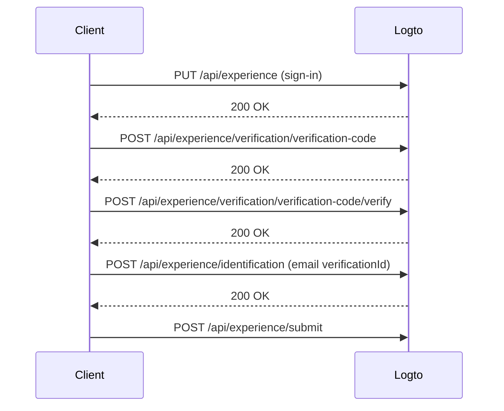
```mermaid
sequenceDiagram
    participant C as Client
    participant L as Logto

    C->>L: PUT /api/experience (sign-in)
    L-->>C: 200 OK
    C->>L: POST /api/experience/verification/verification-code
    L-->>C: 200 OK
    C->>L: POST /api/experience/verification/verification-code/verify
    L-->>C: 200 OK
    C->>L: POST /api/experience/identification (email verificationId)
    L-->>C: 200 OK
    C->>L: POST /api/experience/submit
```

### 5. Sign-in with verification code and fulfill password

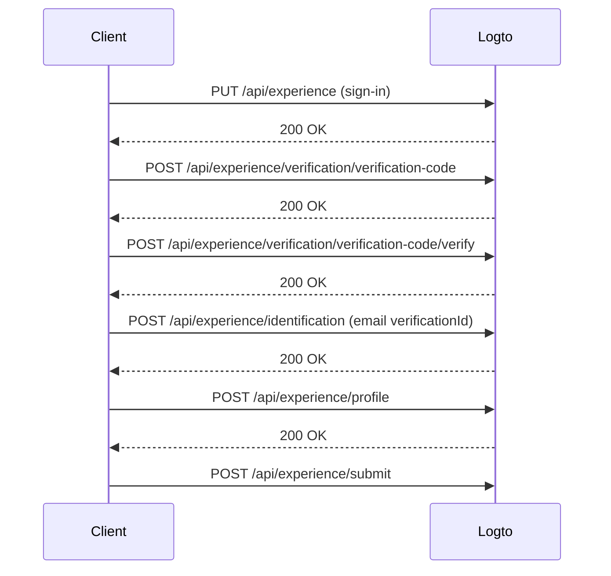
```mermaid
sequenceDiagram
    participant C as Client
    participant L as Logto

    C->>L: PUT /api/experience (sign-in)
    L-->>C: 200 OK
    C->>L: POST /api/experience/verification/verification-code
    L-->>C: 200 OK
    C->>L: POST /api/experience/verification/verification-code/verify
    L-->>C: 200 OK
    C->>L: POST /api/experience/identification (email verificationId)
    L-->>C: 200 OK
    C->>L: POST /api/experience/profile
    L-->>C: 200 OK
    C->>L: POST /api/experience/submit
```

### 6. Sign-in with verification code and fulfill MFA (TOTP and Backup code)

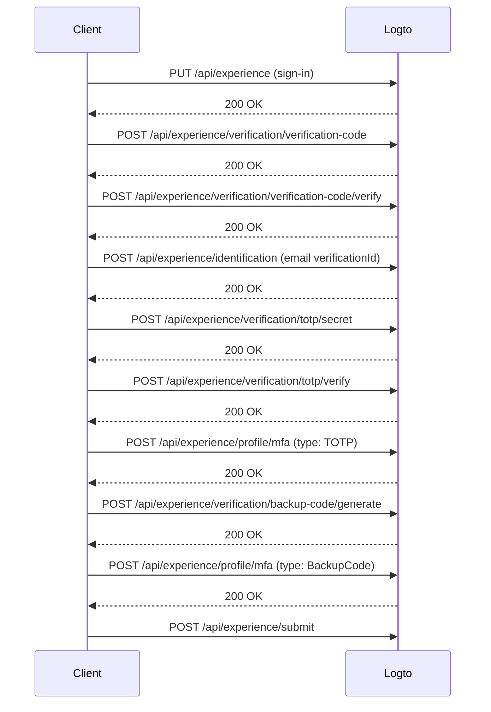
```mermaid
sequenceDiagram
    participant C as Client
    participant L as Logto

    C->>L: PUT /api/experience (sign-in)
    L-->>C: 200 OK
    C->>L: POST /api/experience/verification/verification-code
    L-->>C: 200 OK
    C->>L: POST /api/experience/verification/verification-code/verify
    L-->>C: 200 OK
    C->>L: POST /api/experience/identification (email verificationId)
    L-->>C: 200 OK
    C->>L: POST /api/experience/verification/totp/secret
    L-->>C: 200 OK
    C->>L: POST /api/experience/verification/totp/verify
    L-->>C: 200 OK
    C->>L: POST /api/experience/profile/mfa (type: TOTP)
    L-->>C: 200 OK
    C->>L: POST /api/experience/verification/backup-code/generate
    L-->>C: 200 OK
    C->>L: POST /api/experience/profile/mfa (type: BackupCode)
    L-->>C: 200 OK
    C->>L: POST /api/experience/submit
```

### 7. Sign-in with verification code and skip MFA

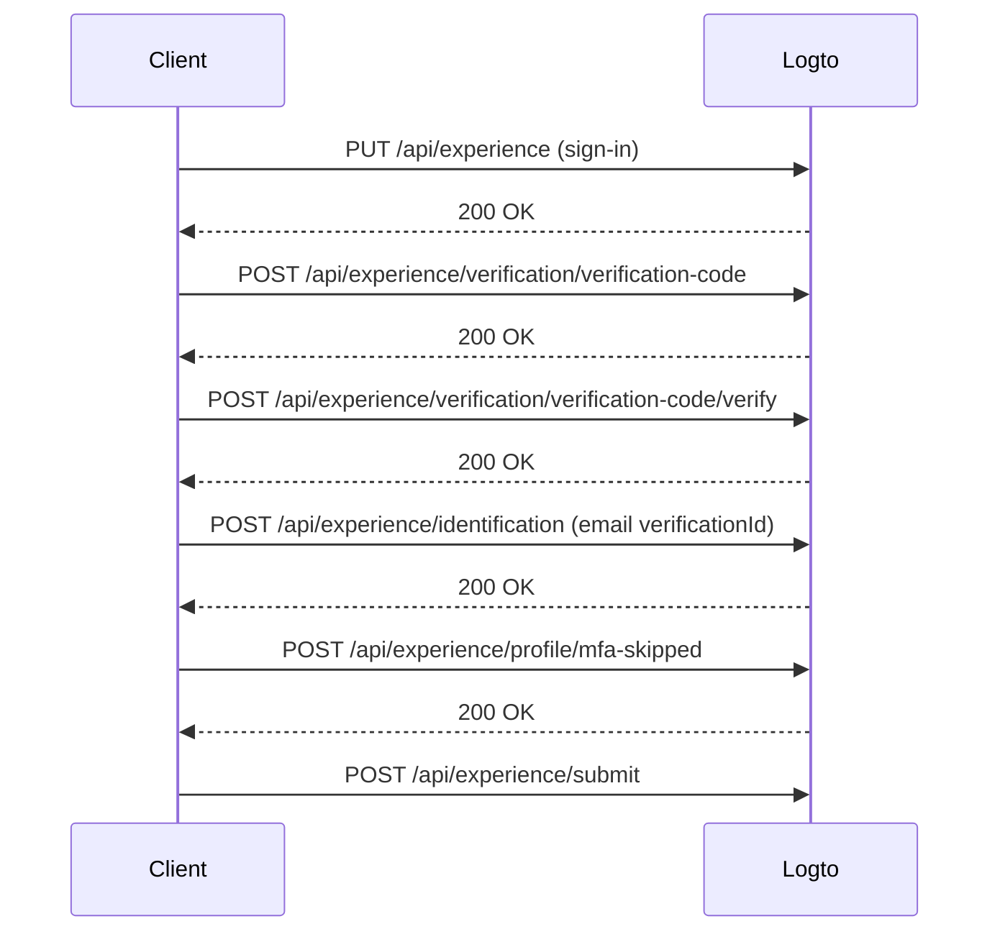
```mermaid
sequenceDiagram
    participant C as Client
    participant L as Logto

    C->>L: PUT /api/experience (sign-in)
    L-->>C: 200 OK
    C->>L: POST /api/experience/verification/verification-code
    L-->>C: 200 OK
    C->>L: POST /api/experience/verification/verification-code/verify
    L-->>C: 200 OK
    C->>L: POST /api/experience/identification (email verificationId)
    L-->>C: 200 OK
    C->>L: POST /api/experience/profile/mfa-skipped
    L-->>C: 200 OK
    C->>L: POST /api/experience/submit
```

### 8. Sign-in with verification code and identity not found, register directly

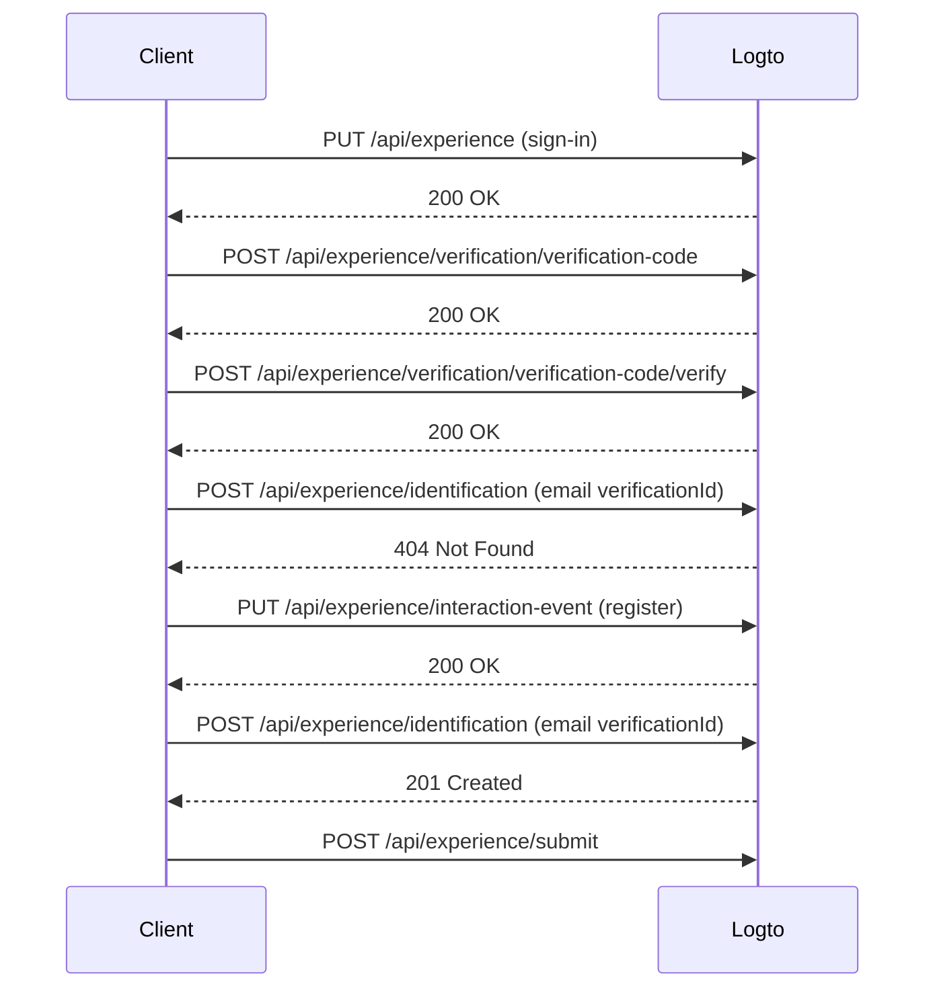
```mermaid
sequenceDiagram
    participant C as Client
    participant L as Logto

    C->>L: PUT /api/experience (sign-in)
    L-->>C: 200 OK
    C->>L: POST /api/experience/verification/verification-code
    L-->>C: 200 OK
    C->>L: POST /api/experience/verification/verification-code/verify
    L-->>C: 200 OK
    C->>L: POST /api/experience/identification (email verificationId)
    L-->>C: 404 Not Found
    C->>L: PUT /api/experience/interaction-event (register)
    L-->>C: 200 OK
    C->>L: POST /api/experience/identification (email verificationId)
    L-->>C: 201 Created
    C->>L: POST /api/experience/submit
```

### 9. Sign-in with social identity

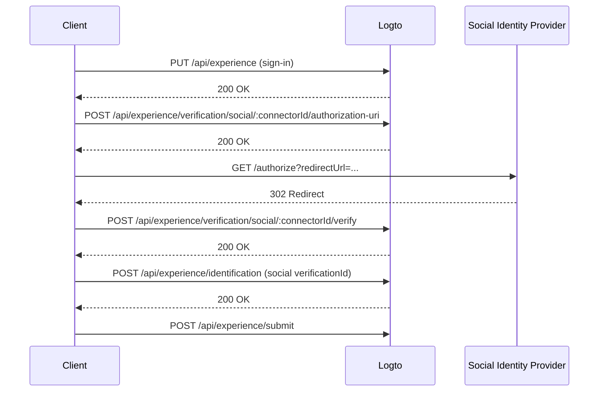
```mermaid
sequenceDiagram
    participant C as Client
    participant L as Logto
    participant S as Social Identity Provider

    C->>L: PUT /api/experience (sign-in)
    L-->>C: 200 OK
    C->>L: POST /api/experience/verification/social/:connectorId/authorization-uri
    L-->>C: 200 OK
    C->>S: GET /authorize?redirectUrl=...
    S-->>C: 302 Redirect
    C->>L: POST /api/experience/verification/social/:connectorId/verify
    L-->>C: 200 OK
    C->>L: POST /api/experience/identification (social verificationId)
    L-->>C: 200 OK
    C->>L: POST /api/experience/submit
```

### 10. Sign-in with social identity and identity not found, register directly

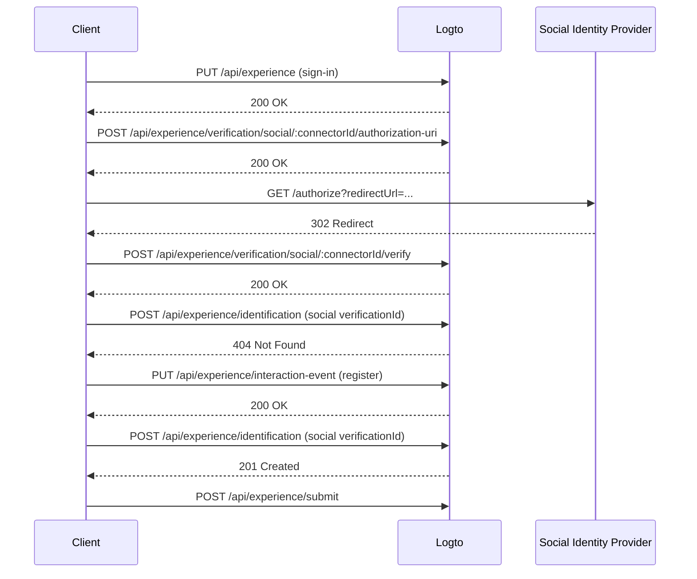
```mermaid
sequenceDiagram
    participant C as Client
    participant L as Logto
    participant S as Social Identity Provider

    C->>L: PUT /api/experience (sign-in)
    L-->>C: 200 OK
    C->>L: POST /api/experience/verification/social/:connectorId/authorization-uri
    L-->>C: 200 OK
    C->>S: GET /authorize?redirectUrl=...
    S-->>C: 302 Redirect
    C->>L: POST /api/experience/verification/social/:connectorId/verify
    L-->>C: 200 OK
    C->>L: POST /api/experience/identification (social verificationId)
    L-->>C: 404 Not Found
    C->>L: PUT /api/experience/interaction-event (register)
    L-->>C: 200 OK
    C->>L: POST /api/experience/identification (social verificationId)
    L-->>C: 201 Created
    C->>L: POST /api/experience/submit
```

### 11. Sign-in with social identity and identity not found, link to existing account with the same verified email

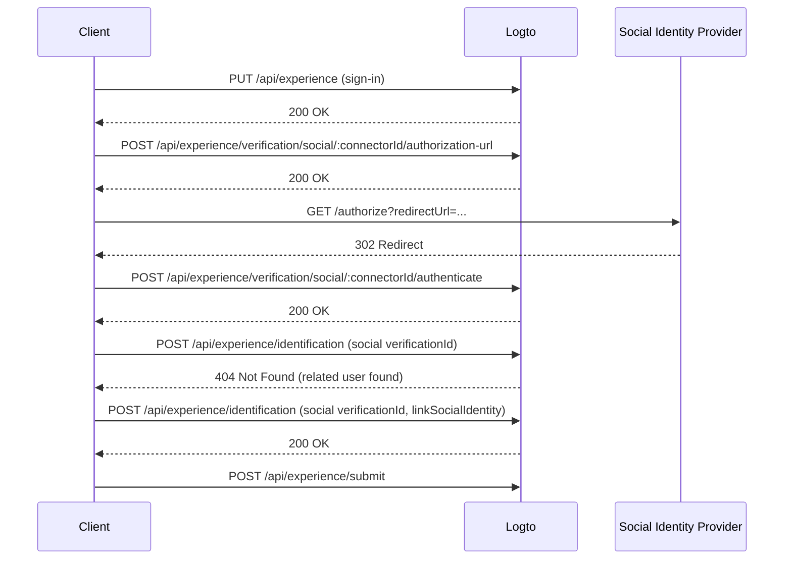
```mermaid
sequenceDiagram
    participant C as Client
    participant L as Logto
    participant S as Social Identity Provider

    C->>L: PUT /api/experience (sign-in)
    L-->>C: 200 OK
    C->>L: POST /api/experience/verification/social/:connectorId/authorization-url
    L-->>C: 200 OK
    C->>S: GET /authorize?redirectUrl=...
    S-->>C: 302 Redirect
    C->>L: POST /api/experience/verification/social/:connectorId/authenticate
    L-->>C: 200 OK
    C->>L: POST /api/experience/identification (social verificationId)
    L-->>C: 404 Not Found (related user found)
    C->>L: POST /api/experience/identification (social verificationId, linkSocialIdentity)
    L-->>C: 200 OK
    C->>L: POST /api/experience/submit
```

### 12. Sign-in with social identity and identity not found, register instead, ask for additional email identifier

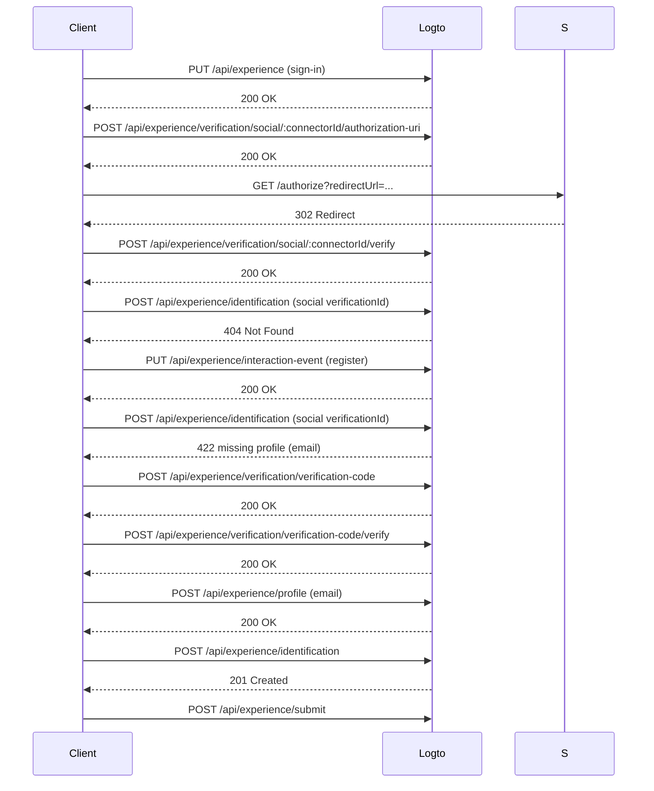
```mermaid
sequenceDiagram
    participant C as Client
    participant L as Logto

    C->>L: PUT /api/experience (sign-in)
    L-->>C: 200 OK
    C->>L: POST /api/experience/verification/social/:connectorId/authorization-uri
    L-->>C: 200 OK
    C->>S: GET /authorize?redirectUrl=...
    S-->>C: 302 Redirect
    C->>L: POST /api/experience/verification/social/:connectorId/verify
    L-->>C: 200 OK
    C->>L: POST /api/experience/identification (social verificationId)
    L-->>C: 404 Not Found
    C->>L: PUT /api/experience/interaction-event (register)
    L-->>C: 200 OK
    C->>L: POST /api/experience/identification (social verificationId)
    L-->>C: 422 missing profile (email)
    C->>L: POST /api/experience/verification/verification-code
    L-->>C: 200 OK
    C->>L: POST /api/experience/verification/verification-code/verify
    L-->>C: 200 OK
    C->>L: POST /api/experience/profile (email)
    L-->>C: 200 OK
    C->>L: POST /api/experience/identification
    L-->>C: 201 Created
    C->>L: POST /api/experience/submit
```

### 13. Sign-in with social identity and identity not found, register instead, ask for additional email identifier, email exists, sign-in and link social identity

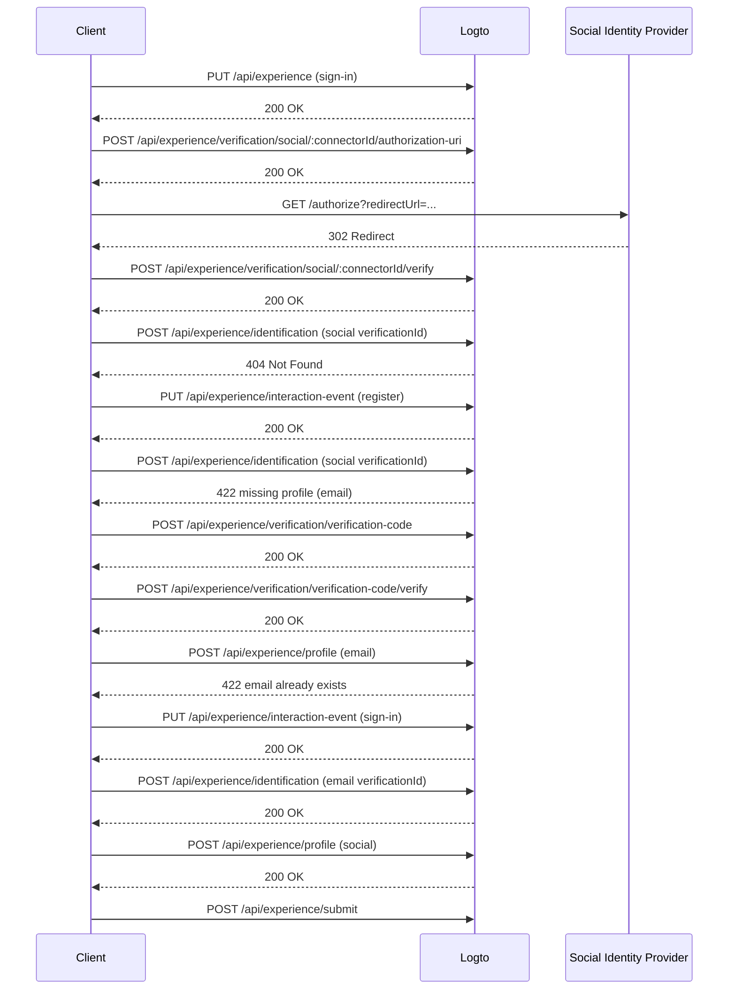
```mermaid
sequenceDiagram
    participant C as Client
    participant L as Logto
    participant S as Social Identity Provider

    C->>L: PUT /api/experience (sign-in)
    L-->>C: 200 OK
    C->>L: POST /api/experience/verification/social/:connectorId/authorization-uri
    L-->>C: 200 OK
    C->>S: GET /authorize?redirectUrl=...
    S-->>C: 302 Redirect
    C->>L: POST /api/experience/verification/social/:connectorId/verify
    L-->>C: 200 OK
    C->>L: POST /api/experience/identification (social verificationId)
    L-->>C: 404 Not Found
    C->>L: PUT /api/experience/interaction-event (register)
    L-->>C: 200 OK
    C->>L: POST /api/experience/identification (social verificationId)
    L-->>C: 422 missing profile (email)
    C->>L: POST /api/experience/verification/verification-code
    L-->>C: 200 OK
    C->>L: POST /api/experience/verification/verification-code/verify
    L-->>C: 200 OK
    C->>L: POST /api/experience/profile (email)
    L-->>C: 422 email already exists
    C->>L: PUT /api/experience/interaction-event (sign-in)
    L-->>C: 200 OK
    C->>L: POST /api/experience/identification (email verificationId)
    L-->>C: 200 OK
    C->>L: POST /api/experience/profile (social)
    L-->>C: 200 OK
    C->>L: POST /api/experience/submit
```

### 14. Register with username and password

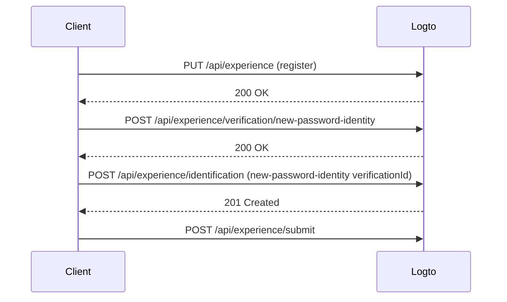
```mermaid
sequenceDiagram
    participant C as Client
    participant L as Logto

    C->>L: PUT /api/experience (register)
    L-->>C: 200 OK
    C->>L: POST /api/experience/verification/new-password-identity
    L-->>C: 200 OK
    C->>L: POST /api/experience/identification (new-password-identity verificationId)
    L-->>C: 201 Created
    C->>L: POST /api/experience/submit
```

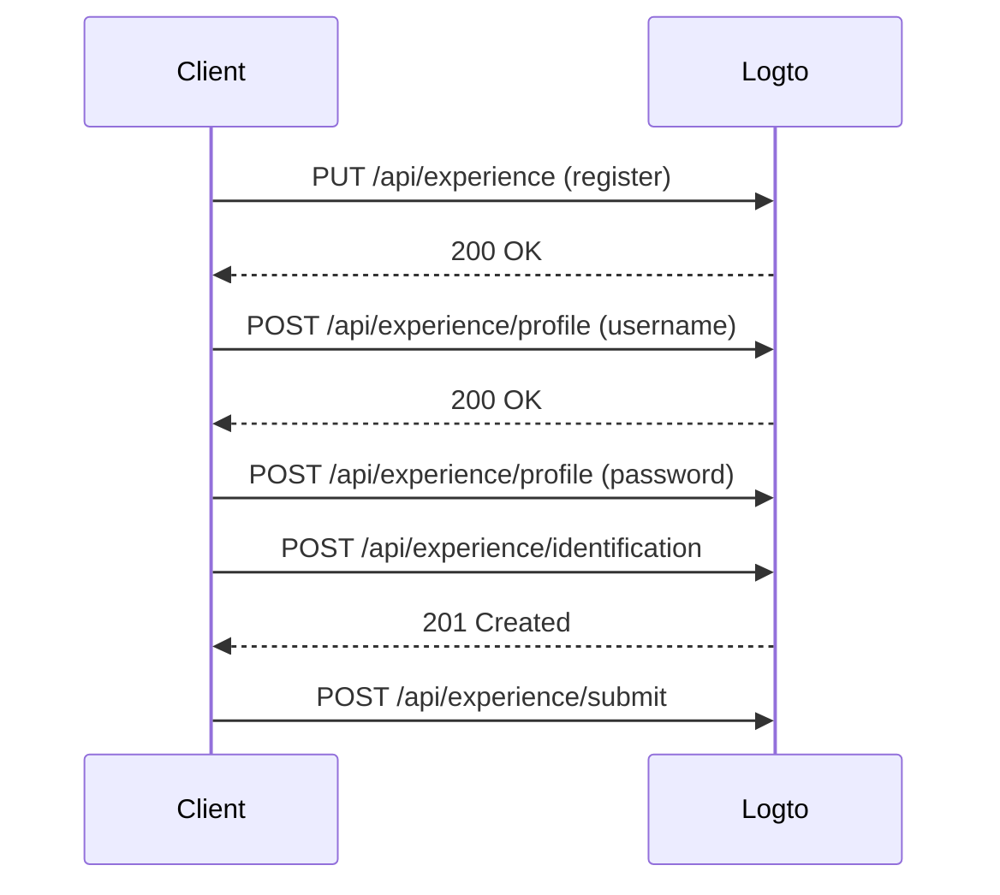
```mermaid
sequenceDiagram
    participant C as Client
    participant L as Logto

    C->>L: PUT /api/experience (register)
    L-->>C: 200 OK
    C->>L: POST /api/experience/profile (username)
    L-->>C: 200 OK
    C->>L: POST /api/experience/profile (password)
    C->>L: POST /api/experience/identification
    L-->>C: 201 Created
    C->>L: POST /api/experience/submit
```

### 15. Register with email and password

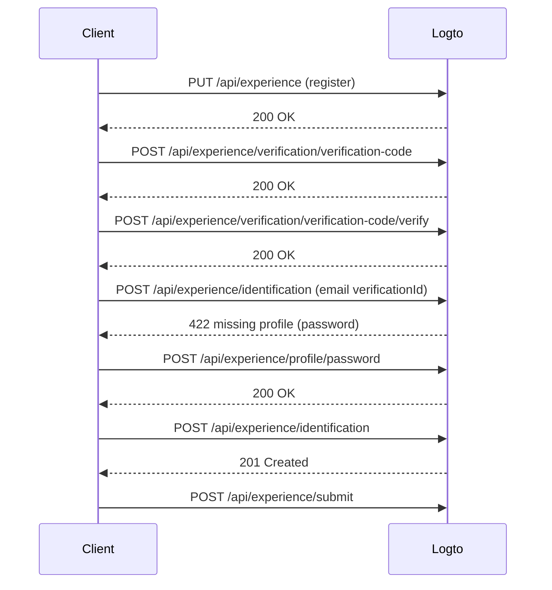
```mermaid
sequenceDiagram
    participant C as Client
    participant L as Logto

    C->>L: PUT /api/experience (register)
    L-->>C: 200 OK
    C->>L: POST /api/experience/verification/verification-code
    L-->>C: 200 OK
    C->>L: POST /api/experience/verification/verification-code/verify
    L-->>C: 200 OK
    C->>L: POST /api/experience/identification (email verificationId)
    L-->>C: 422 missing profile (password)
    C->>L: POST /api/experience/profile/password
    L-->>C: 200 OK
    C->>L: POST /api/experience/identification
    L-->>C: 201 Created
    C->>L: POST /api/experience/submit
```

### 16. Register with username and password with MFA setup (WebAuthn)

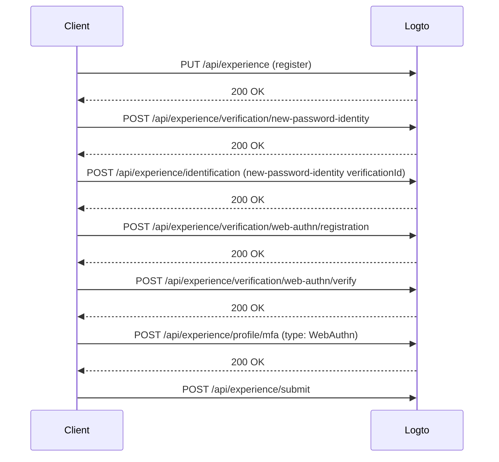
```mermaid
sequenceDiagram
    participant C as Client
    participant L as Logto

    C->>L: PUT /api/experience (register)
    L-->>C: 200 OK
    C->>L: POST /api/experience/verification/new-password-identity
    L-->>C: 200 OK
    C->>L: POST /api/experience/identification (new-password-identity verificationId)
    L-->>C: 200 OK
    C->>L: POST /api/experience/verification/web-authn/registration
    L-->>C: 200 OK
    C->>L: POST /api/experience/verification/web-authn/verify
    L-->>C: 200 OK
    C->>L: POST /api/experience/profile/mfa (type: WebAuthn)
    L-->>C: 200 OK
    C->>L: POST /api/experience/submit
```

### 17. Register with email and identity exists with the same email, sign-in directly

```mermaid
sequenceDiagram
    participant C as Client
    participant L as Logto

    C->>L: PUT /api/experience (register)
    L-->>C: 200 OK
    C->>L: POST /api/experience/verification/verification-code
    L-->>C: 200 OK
    C->>L: POST /api/experience/verification/verification-code/verify
    L-->>C: 200 OK
    C->>L: POST /api/experience/identification (email verificationId)
    L-->>C: 422 Account Already Exists
    C->>L: PUT /api/experience/interaction-event (sign-in)
    L-->>C: 200 OK
    C->>L: POST /api/experience/identification (email verificationId)
    L-->>C: 200 OK
    C->>L: POST /api/experience/submit
```

### 18. Forgot password with email

```mermaid
sequenceDiagram
    participant C as Client
    participant L as Logto

    C->>L: PUT /api/experience (forgot-password)
    L-->>C: 200 OK
    C->>L: POST /api/experience/verification/verification-code
    L-->>C: 200 OK
    C->>L: POST /api/experience/verification/verification-code/verify
    L-->>C: 200 OK
    C->>L: POST /api/experience/identification (email verificationId)
    L-->>C: 200 OK
    C->>L: PUT /api/experience/profile/password
    L-->>C: 200 OK
    C->>L: POST /api/experience/submit
```
