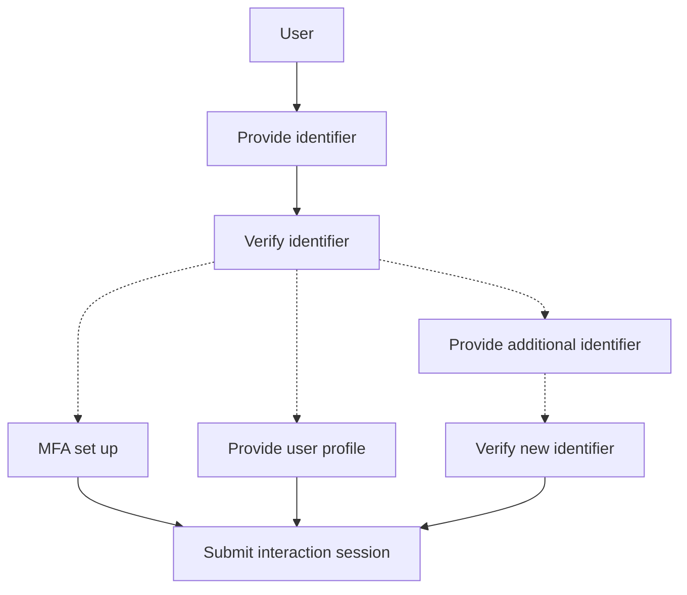
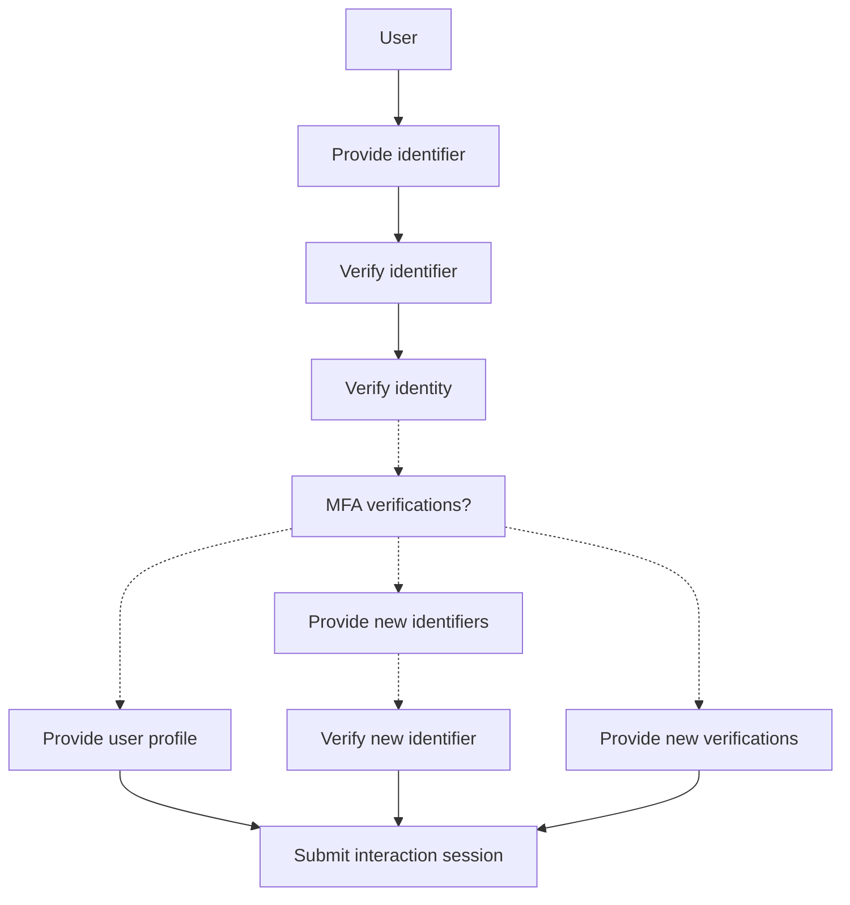
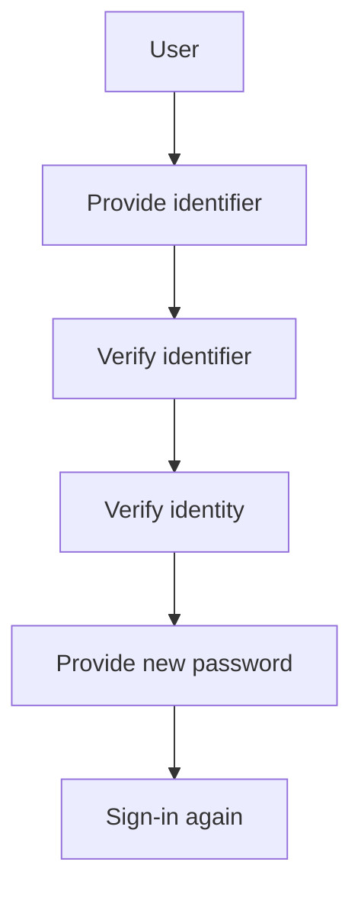

# User interaction flow and experience APIs

**Table of Contents**

- [1. Abstract](#1-abstract)
- [2. Motivation](#2-motivation)
- [3. Introduction](#3-introduction)
  - [3.1 Terminology](#31-terminology)
- [4. Definitions](#4-definitions)
  - [4.1 Interaction events](#41-interaction-events)
  - [4.2 Identifiers](#42-identifiers)
  - [4.3 Verification records](#43-verification-records)
  - [4.4 Profile](#44-profile)
  - [4.5 Multi-Factor Authentication(MFA)](#45-multi-factor-authenticationmfa)
- [5. Interaction session](#5-interaction-session)
  - [5.1 Interaction session lifecycle](#51-interaction-session-lifecycle)

## 1. Abstract

User interaction flow is a key part of the [OpenID Connect](https://openid.net/specs/openid-connect-core-1_0.html) authentication process in Logto. It is the process of communication between the user and the Logto platform. Upon each user authentication request, the user will be prompted to provide their credentials. The user will then be able to interact with the platform through the user interface.

## 2. Motivation

The user interaction flow as well as the `experience APIs` are designed to be intuitive and developer-friendly. The goal is to provide a seamless and secure authentication process for users. Allowing developers to customize the user experience to suit their needs.

Current version of user interaction APIs in Logto are neither well-documented nor publicly available for developers. This document aims to provide a comprehensive overview of the user interaction flow and introduce a whole new version of user `experience APIs` in Logto.

## 3. Introduction

A complete user interaction flow can be divided into following steps:

1. **identification**: The user needs to provide a unique `identifier` to the platform. This can be a username, email address, or third-party social identity. It will be used to uniquely identify the user in the system.
2. **verification**: The `verification` process is used to verify the user's identity by asking for additional security information. This can be a password, a one-time code, or a passkey. Upon the security settings multiple verification methods can be used.
3. **profile completion**: The user may be prompted to complete their `profile` and `mfa` settings during a interaction session. This can be a first-time user registration, a mandatory profile and `mfa` settings update for exiting users, or a additional third-party identity linking.
4. **authentication**: The last step is the `authentication` process. The user will be authenticated and granted access to the platform by submitting current interaction session once all the mandatory security checks are resolved.

### 3.1 Terminology

- **sign-in experience(SIE)**: A user's experience when interacting with Logto platform. Including the front-end UI and the back-end API calls.
- **experience APIs**: A set of APIs that allow end-users to interact with the Logto for identity verification and profile management.
- **interaction session**: A session that is initiated when a user starts interacting with the Logto platform. The session will be terminated once the user logs out or the session expires.
- **experience app**: The front-end application that provides the user interface for the user interaction flow.
- **social/Single Sign-On(SSO) identity**: A third-party identity provider that allows users to sign in to the Logto platform using their social media or enterprise SSO accounts.
- **identifier**: A piece of information that can be used to identify a user in the Logto system. For example, username, email, phone number, or social/SSO identity.
- **verification record**: A `verification record` is a group of security data can be used to verify a user's identity by such as password, verification code, or TOTP code.
- **verification code**: A one-time code sent to the user's email or phone number for identity verification.
- **verification id**: The unique identifier for a verification record. Generated by the Logto server when a verification flow is initiated. User need to provide the verification id along with additional security information to verify their identity. The verification id can also be used to track the verification record status within the interaction session.
- **Multi-Factor Authentication(MFA)**: A security process that requires more than one verification factor to verify a user's identity.

## 4. Definitions

### 4.1 Interaction events

Interaction events represent the user's interaction with the Logto platform. The following are the key interaction events that can occur during a user interaction session:

- **Register**: A user signs up for a new account.
- **SignIn**: A user signs in to an existing account.
- **ForgotPassword**: A user forgets their password and initiates an account recovery process.

Interaction events helps to track the user's progress during the interaction session. The Logto platform can use these events to provide a personalized user experience and security checks based on the user's interaction session status.

### 4.2 Identifiers

`Identifiers` are used to uniquely identify a user in the Logto system. The following are the types of `identifiers` supported by the Logto platform:

- **username**: A unique username chosen by the user during the registration process.
- **email**: A verified user's email address.
- **phone**: A verified user's phone number.
- **social/SSO identity**: A verified third-party social or enterprise identity.

Before a user can claim an identifier for future identification use, some identifiers must be verified by the user to ensure the ownership of the identifier. The verification process can be done by creating a verification record and providing the necessary security information. Following are the identifier verification methods supported by the Logto platform:

| Identifier Type | Verification Method       |
| --------------- | ------------------------- |
| email           | email verification        |
| phone           | phone verification        |
| social/SSO      | social/SSO authentication |

### 4.3 Verification records

A coming user must provide at least one `verification record` to verify their identity. A `verification record` is a record that contains the necessary security information to verify a user's identity. The following are the types of `verification records` supported by the Logto platform:

- **password**: A user's password, the most common way to verify a user's identity.
- **verification code**: A one-time code sent to the user's email or phone number for identity verification.
- **TOTP code(MFA only)**: A time-based one-time code generated by a TOTP app for identity verification.
- **webauthn(MFA only)**: A webauthn credential that can be used to verify a user's identity.
- **backup code(MFA only)**: A group of backup codes that can be used to verify a user's identity when the rest of verification methods are not available.
- **social/SSO authentication**: A well authenticated social/SSO identity that can be used to verify a user's identity directly.

### 4.4 Profile

User profile is the user's personal information stored in the Logto system. The user profile includes the data that can be used as a `identifier` for the user, such as username, email, phone number, and social/SSO identity, and other personal information such as name, address, and profile picture.

The user profile can be updated by the user during the interaction session. The Logto platform can use the user profile to provide a personalized user experience and security checks based on the SIE settings.

### 4.5 Multi-Factor Authentication(MFA)

MFA is a security process that requires more than one verification factor to verify a user's identity. It can be used as an additional security check during the user interaction flow. Developers can enable MFA using the Logto's SIE settings. Once MFA is enabled, the user will be prompted to provide additional MFA verification records during the interaction session.

## 5. Interaction session

Interaction session is a session that is initiated when a user starts an interaction flow with the Logto platform. Logto platform uses the interaction session to track the user's progress during the interaction flow. The interaction session will be terminated once the user logs out or the session expires.

### 5.1 Interaction session lifecycle

To better understand the user interaction flow, we need to understand the lifecycle of an interaction session.

| Interaction Session State | Description                                                                                    | Restrictions                                                                                                                                              |
| ------------------------- | ---------------------------------------------------------------------------------------------- | --------------------------------------------------------------------------------------------------------------------------------------------------------- |
| `initiated`               | The interaction session is initiated when a user sends an authentication request to the Logto. | The user can only have one active interaction session at a time. All experience APIs require a valid interaction session.                                 |
| `identified`              | The user has provided a valid identifier and at least one related verification record.         | The user can be identified by the Logto system. The interaction session can access the user's profile and MFA settings for further security checks.       |
| `verified`                | The user has provide all necessary verification records.                                       | The user is fully verified by the Logto system. The user can proceed to the user profile completion and authentication process based on the SIE settings. |
| `authenticated`           | The interaction session has been submitted. Authorization granted                              | The user can access the platform resources and services. The interaction session will be terminated once the user logs out or the session expires.        |

## Appendix

### A. Experience APIs

The experience APIs are a set of APIs that allow end-users to interact with the Logto platform to complete the user interaction flow.

#### 1. Interaction events API

```ts
type Identifier = {
  type: "username" | "email" | "phone";
  value: string;
};

type Verification = {
  type: "password" | "verification_code";
  /** Can be omitted if a existing verified verification record exist */
  value?: string;
  /** Required if a existing verification record is created for the given identifier */
  verificationId?: string;
};
```

##### Register

`POST /experience/api/register`

The `register` API is used to create a new account in the Logto system. The user must provide at least one `identifier` and a `verification record` to uniquely identify themselves in the Logto system.

Request body:

| Field        | Type         | Description                                  | Required |
| ------------ | ------------ | -------------------------------------------- | -------- |
| identifier   | Identifier   | The user's `identifier`.                     | Yes      |
| verification | Verification | Security data to verify the user's identity. | Yes      |

##### Sign in

`POST /experience/api/sign-in`

The `sign-in` API is used to sign in to an existing account in the Logto system. The user must provide a valid `identifier` and a `verification record` to verify their identity.

Request body:

| Field          | Type         | Description                                        | Required |
| -------------- | ------------ | -------------------------------------------------- | -------- |
| identifier     | Identifier   | The user's `identifier`.                           | Yes      |
| verification   | Verification | Security data to verify the user's identity.       | No       |
| verificationId | string       | The unique id for a existing `verification record` | No       |

##### Forgot password

`POST /experience/api/forgot-password`

The `forgot-password` API is used to initiate an account recovery process in the Logto system. The user must provide a valid `identifier` to start the account recovery process.

Request body:

| Field        | Type         | Description                                  | Required |
| ------------ | ------------ | -------------------------------------------- | -------- |
| identifier   | Identifier   | The user's `identifier`.                     | Yes      |
| verification | Verification | Security data to verify the user's identity. | Yes      |

#### 2. Social/SSO authentication API

##### Get authorization URL

`POST /experience/api/{social|SSO}/:connectorId/authorization-url`

The `authorization-url` API is used to generate an authorization URL for the user to authenticate with a third-party social or enterprise identity provider.

This will initiate a new social/SSO sign-in interaction event.

##### Authenticate

`POST /experience/api/{social|SSO}/:connectorId/authenticate`

Authenticate the user with the social/SSO provider and return the user's social/SSO identity.

Request body:

| Field | Type                   | Description                                |
| ----- | ---------------------- | ------------------------------------------ |
| data  | Record<string, string> | callback data from the social/SSO provider |

##### Register new account with social/SSO identity

`POST /experience/api/{social|SSO}/:connectorId/register`

Create a new social/SSO account if the social/SSO identity is not found in the Logto system.

:::note
This API will turn a social/SSO sign-in event into a register event.
:::

##### Link social/SSO identity to existing account

`POST /experience/api/social/:connectorId/link`

Link social identity to an existing account. Logto will use the `verified_email` from the social identity to find the existing account.

:::note
SSO identity will be automatically linked to the existing account if the social/SSO identity is found in the Logto system.
:::

#### 3. Profile management API

##### Update profile

`PATCH /experience/api/profile`

The `profile` API is used to update the user's profile information in the Logto system. For identifier update a valid `verification record` must be provided.

Request body:

| Field        | Type                            | Description                                       | Required                       |
| ------------ | ------------------------------- | ------------------------------------------------- | ------------------------------ |
| email        | string                          | The user's email address.                         | No                             |
| phone        | string                          | The user's phone number.                          | No                             |
| username     | string                          | The user's username.                              | No                             |
| name         | string                          | The user's full name.                             | No                             |
| profile      | Profile                         | The user's profile information.                   | No                             |
| verification | Verification<verification_code> | The security data to verify the given identifier. | No (Yes for identifier update) |

##### Skip MFA setup

`POST /experience/api/profile/mfa-skipped`

The `mfa-skipped` API is used to skip the MFA setup process for the user.

#### 4. Verification API

##### Generate verification code

`POST /experience/api/verification/verification-code/generate`

Calling the `verification-code` API will initiate a verification process for the given `identifier`. A unique `verification id` will be generated for the verification process. The user must provide the `verification id` and the `verification code` to verify the given `identifier`.

Request body:

| Field            | Type             | Description                                                     | Required |
| ---------------- | ---------------- | --------------------------------------------------------------- | -------- |
| identifier       | Identifier       | The user's `identifier`.                                        | Yes      |
| interactionEvent | InteractionEvent | The `interaction event` that triggers the verification process. | Yes      |

A unique `verification id` will be generated for the verification process.

Response body:

```ts
{
  verificationId: string;
}
```

##### Verify verification code

`POST /experience/api/verification/verification-code/verify`

The `verification-code/verify` API is used to verify the given `identifier` with the provided `verification code`. The user must provide the `verification id` and the `verification code` to verify the given `identifier`. A success `verification record` will be created for the given `identifier` if the verification is successful.

Request body:

| Field          | Type       | Description                                           | Required |
| -------------- | ---------- | ----------------------------------------------------- | -------- |
| identifier     | Identifier | The user's `identifier`.                              | Yes      |
| code           | string     | The verification code to verify the given identifier. | Yes      |
| verificationId | string     | The unique id for the verification record.            | Yes      |

##### Generate TOTP secret

Create a new TOTP secret for the user to set up the TOTP MFA method.
The new created TOTP secret will be inserted into the user's MFA settings once the verification is successful and the interaction session is submitted.

`POST /experience/api/verification/totp/secret`

Response body:

```ts
{
  secret: string;
  qrCodeUrl: string;
  verificationId: string;
}
```

##### Verify TOTP code

`POST /experience/api/verification/totp/verify`

TOTP code verification API. The user must provide the `verification id` if the TOTP is newly created.

Request body:

| Field           | Type   | Description                                      | Required |
| --------------- | ------ | ------------------------------------------------ | -------- |
| code            | string | The TOTP code to verify the TOTP MFA method      | Yes      |
| verificationId? | string | The verification id for the new generated secret | No       |

##### Create a WebAuthn registration

`POST /experience/api/verification/webauthn/registration`

Create a new WebAuthn registration options object for the user to verify and set up the WebAuthn MFA method.
The new created WebAuthn credential will be inserted into the user's MFA settings once the verification is successful and the interaction session is submitted.

Response body:

```ts
{
  registrationOptions: WebAuthnRegistrationOptions;
  verificationId: string;
}
```

##### Create a WebAuthn authentication

`POST /experience/api/verification/webauthn/authentication`

Create a new WebAuthn authentication options object for the user to verify the WebAuthn MFA method.

Response body:

```ts
{
  authenticationOptions: WebAuthnAuthenticationOptions;
  verificationId: string;
}
```

##### Verify WebAuthn

`POST /experience/api/verification/webauthn/verify`

Verify the WebAuthn MFA method with the provided WebAuthn assertion.

Request body:

| Field             | Type              | Description                                                   | Required |
| ----------------- | ----------------- | ------------------------------------------------------------- | -------- |
| webauthnAssertion | WebAuthnAssertion | The WebAuthn assertion data to verify the WebAuthn MFA method | Yes      |
| verificationId    | string            | The verification record id                                    | Yes      |

##### Create backup codes

`POST /experience/api/verification/backup-codes/generate`

Generate a new set of backup codes for the user to set up the Backup Code MFA method.
The new created backup codes will be inserted into the user's MFA settings once the verification is successful and the interaction session is submitted.

Response body:

```ts
{
  backupCodes: string[];
  verificationId: string;
}
```

##### Verify backup code

`POST /experience/api/verification/backup-code/verify`

Verify the Backup Code MFA method with the provided backup code.

Request body:

| Field      | Type   | Description                                   | Required |
| ---------- | ------ | --------------------------------------------- | -------- |
| backupCode | string | the backup code to verify the Backup Code MFA | Yes      |

#### 5. Interaction session API

##### Submit interaction session

`POST /experience/api/submit`

The `submit` API is used to submit the user's interaction session to the Logto platform. The user must provide a valid interaction session to authenticate and access the platform resources.

If any new profile or MFA settings are updated during the interaction session, the user must submit the interaction session to save the changes.

##### Get interaction session status

`GET /experience/api/session-status`

The `session-status` API is used to get the current status of the user's interaction session. The user can use this API to check the progress and missing security checks during the interaction flow.

### B. User interaction flow

#### 1. Register

When a user signs up for a new account, they need to provide at least one identifier to uniquely identify themselves in the Logto system. The identifier must be verified before it can be used for future identification.



#### 2. Sign in

When a user signs in to an existing account, they need to provide at least one identifier to identify themselves in the Logto system.



#### 3. Forgot password

When a user resets their password, they need to provide at least one identifier to identify themselves in the Logto system. Currently, Logto only supports resetting the password using the email or phone identifier with a verification code verification factor.


